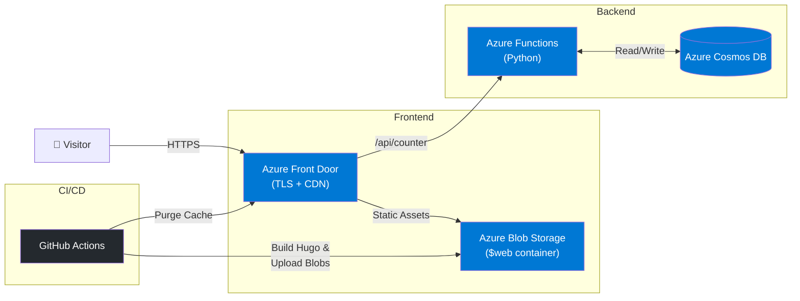

<div align="center">

# ☁️ Azure Cloud Resume Challenge

**A full-stack serverless portfolio deployed entirely on Microsoft Azure**

[](https://github.com/ChetanThapliyal/Azure-Cloud-Resume-Challenge/actions/workflows/azure-deploy-frontend.yml)


[**🌐 Live Site**](https://az.chetan-thapliyal.cloud) · [**📖 Blog**](https://blog.chetan-thapliyal.cloud) · [**📄 Migration Runbook**](docs/frontdoorMigration.md) · [**🏗️ IaC Docs**](docs/terraform-iac.md)

</div>

---

## Architecture



## Tech Stack

| Layer | Technology | Purpose |
|:---|:---|:---|
| **Frontend** | Hugo (GoFolium) | Modern, responsive portfolio theme with HSL-tailored design |
| **Hosting** | Azure Blob Storage | Static website hosting via `$web` container |
| **CDN / TLS** | Azure Front Door | Global edge caching, managed TLS, and secure routing |
| **API** | Azure Functions (Python) | Serverless backend using the Table API for visitor tracking |
| **Database** | Azure Cosmos DB | Global persistence using the Table API (Serverless) |
| **IaC** | Terraform | Production-grade infrastructure automation |
| **CI/CD** | GitHub Actions | Fully automated Build -> Deploy -> Caching pipeline |
| **DNS** | Cloudflare | Custom domain management with `az` subdomain |

## Project Structure

```
Azure-Cloud-Resume-Challenge/
├── backend/                    # Serverless API (Python 3.12)
│   ├── visitorCounter/         # Azure Function — visitor counter
│   ├── host.json               # Function host configuration
│   └── requirements.txt        # Table API dependencies
├── docs/                       # Project Documentation
│   ├── deployment.md           # Build & deploy guide
│   ├── frontdoorMigration.md   # CDN → Front Door migration runbook
│   └── terraform-iac.md        # Infrastructure as Code documentation
├── frontend/                   # Hugo Portfolio site
│   ├── config.toml             # Gofolium configuration
│   ├── content/english/         # Bio, projects, and author profile
│   ├── layouts/                # Template overrides (Project cards, Header)
│   ├── static/images/          # Assets and project thumbnails
│   └── themes/gofolium/         # Portfolio theme
├── infrastructure/             # Terraform Managed Resources
│   ├── compute.tf              # Functions, App Insights
│   ├── database.tf             # Cosmos DB (Table API)
│   ├── networking.tf           # Front Door & Custom Domains
│   ├── storage.tf              # Frontend & Backend Storage
│   └── main.tf/variables.tf    # Global configuration
└── .github/workflows/
    └── azure-deploy-frontend.yml  # CI/CD pipeline
```

## How It Works

1. **Visitor opens** `az.chetan-thapliyal.cloud`
2. **Azure Front Door** terminates TLS and serves cached static assets from the nearest edge PoP
3. On cache miss, Front Door fetches from the **Azure Blob Storage** origin (`$web` container)
4. The page JavaScript calls the `/api/counter` endpoint
5. **Azure Functions** reads/increments the counter in **Cosmos DB** and returns the updated count
6. The visitor counter updates live on the page

## Quick Start

### Prerequisites

- [Hugo Extended](https://gohugo.io/installation/) ≥ v0.110
- [Azure CLI](https://learn.microsoft.com/cli/azure/install-azure-cli)
- An Azure subscription with the resources provisioned (see `infrastructure/`)

### Local Development

```bash
# Clone the repo
git clone https://github.com/ChetanThapliyal/Azure-Cloud-Resume-Challenge.git
cd Azure-Cloud-Resume-Challenge/frontend

# Start Hugo dev server
hugo server -D

# Site available at http://localhost:1313
```

### Deploy to Azure

```bash
# Build production assets
cd frontend && hugo --minify

# Upload to Blob Storage
az storage blob delete-batch --account-name <STORAGE_ACCOUNT> --source '$web'
az storage blob upload-batch --account-name <STORAGE_ACCOUNT> \
  --destination '$web' --source public/ --overwrite

# Purge Front Door cache
az afd endpoint purge \
  --endpoint-name <ENDPOINT> \
  --profile-name <PROFILE> \
  --resource-group <RG> \
  --content-paths "/*"
```

### Infrastructure Management (IaC)

This project uses **Terraform** to provision and manage Azure resources. The configuration is modular and stored in the `infrastructure/` directory.

#### Provisioning Steps

1. **Initialize Terraform**:

   ```bash
   cd infrastructure
   terraform init
   ```

2. **Review the Plan**:

   ```bash
   terraform plan -var-file="secrets.tfvars"
   ```

3. **Apply Changes**:

   ```bash
   terraform apply -var-file="secrets.tfvars" -auto-approve
   ```

> [!NOTE]
> The infrastructure includes Azure Front Door, Blob Storage (Static Website), Azure Functions (Python 3.12), and Cosmos DB (Serverless SQL with Table API capability).

> [!TIP]
> Pushing to `main` triggers the GitHub Actions workflow, which handles the full build → upload → purge pipeline automatically.

## CI/CD Pipeline

The [GitHub Actions workflow](.github/workflows/azure-deploy-frontend.yml) runs on every push to `main`:

```
Checkout → Setup Hugo → Build (--minify) → Azure Login → Delete stale blobs → Upload → Purge Front Door
```

**Required secrets:**

| Secret | Description |
|:---|:---|
| `AZURE_CREDENTIALS` | Service principal JSON for `az login` |
| `AZURE_STORAGE_ACCOUNT_NAME` | Storage account name (e.g. `foliocode`) |
| `AZURE_RESOURCE_GROUP` | Resource group name |

## Documentation

| Document | Description |
|:---|:---|
| [deployment.md](docs/deployment.md) | Step-by-step build and deploy guide with troubleshooting |
| [frontdoorMigration.md](docs/frontdoorMigration.md) | Azure CDN → Front Door migration runbook |
| [terraform-iac.md](docs/terraform-iac.md) | Deep dive into the Terraform IaC implementation |

## Key Learnings

- Architecting a **serverless full-stack application** on Azure with zero VM management
- Configuring **Azure Front Door** with custom domains, managed TLS certificates, and cache rules
- Building **CI/CD pipelines** with GitHub Actions for infrastructure and application deployment
- Using **Cosmos DB bindings** with Azure Functions for low-latency data access
- Migrating from **Azure CDN Classic** to **Azure Front Door Standard** with zero downtime
- Implementing **Infrastructure as Code** with Terraform for reproducible cloud environments

## Acknowledgements

This project is part of the [**Cloud Resume Challenge**](https://cloudresumechallenge.dev/) by [Forrest Brazeal](https://forrestbrazeal.com/) - adapted for Microsoft Azure.

---

<div align="center">

**Built with ☁️ by [Chetan Thapliyal](https://www.linkedin.com/in/chetanthapliyal/)**

</div>
